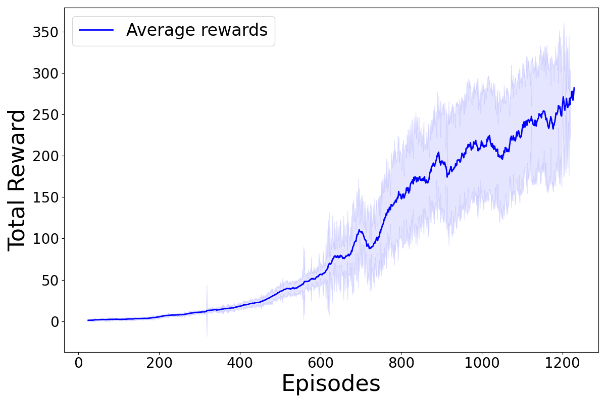
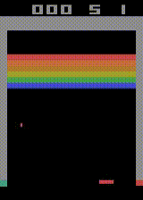
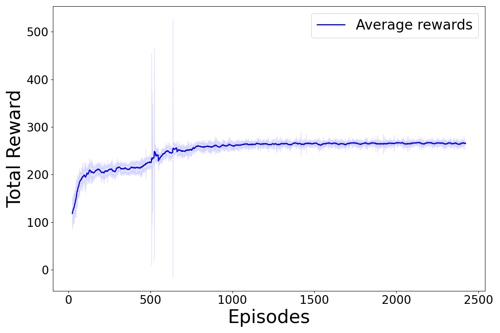
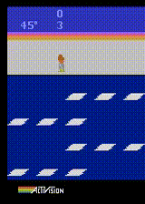
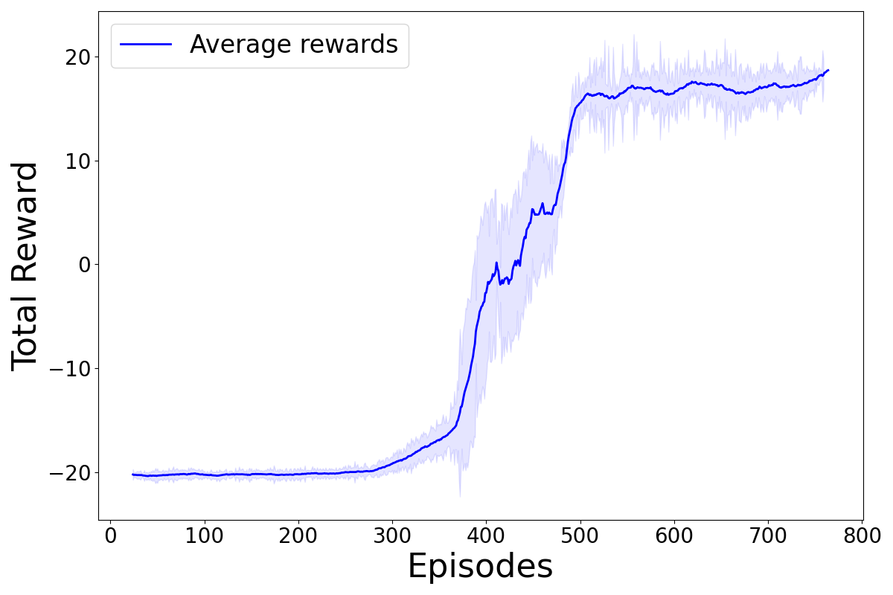
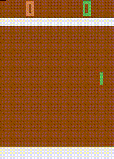
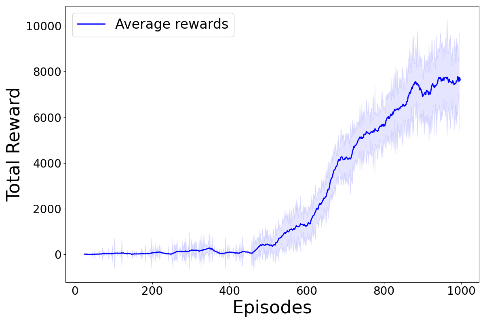
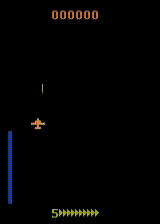

# Reinforcement Learning Agents — A2C, PPO & GRPO (PyTorch)

PyTorch implementation of Advantage Actor-Critic (A2C), Proximal Policy Optimization (PPO), and Generalized REINFORCE Policy Optimization (GRPO).  
Supports both vectorized environments and Atari (CNN-based) setups.

## Installation

```
pip install -r requirements.txt
```

## Quick Usage

The repository provides `main.py` to train or evaluate agents using a JSON configuration file:

```
python main.py --config path/to/config.json
```

If `load_model` is set, the script runs in evaluation mode using the saved model.  
If empty, the script runs in training mode.

## KL Sweep (GRPO Only)

You can run a KL sweep for GRPO directly from config. This is intended for comparisons like
`use_kl=false` vs `kl_coef ∈ {0.01, 0.04, 0.08}` across multiple seeds and environments.

Example config snippet:

```json
{
    "agent_type": "grpo",
    "sweep": {
        "enabled": true,
        "envs": ["MountainCarContinuous-v0", "FetchReach-v4"],
        "kl_coefs": [0.0, 0.01, 0.04, 0.08],
        "seeds": [0, 1, 2, 3, 4],
        "log_root": "logs/kl_sweep",
        "run_tag": "kl_sweep"
    }
}
```

Notes:
- `kl_coef = 0.0` disables KL for that run.
- Logs are organized as `logs/kl_sweep/<env>/kl_<coef>/seed_<seed>/`.
- A `config.json` snapshot is saved inside each run folder.

## Expected `rollouts` Format (A2C & PPO)

The `update_agent` method expects a dictionary `rollouts` with:

- `states`: (T, N, obs_dim) or (T, N, C, H, W) for Atari  
- `actions`: (T, N)  
- `rewards`: (T, N)  
- `value_preds`: (T, N)  
- `masks`: (T, N)  
- `old_log_probs`: (T, N)  
- `entropies`: (T, N)

Where:

- T = steps per update  
- N = number of vectorized environments (`n_envs`)

## Expected Episode Format (GRPO)

GRPO does not use rollouts.  
Instead, it consumes full-episode dictionaries of the form:

```
{
    "states": (L, obs_dim),
    "actions": (L, action_dim),
    "old_log_probs": (L),
    "old_logits": (L, action_dim),  // for KL
    "old_stds": (L, action_dim),    // continuous actions
    "pre_tanh_actions": (L, action_dim), // continuous actions
    "rewards": (L)
}
```

Where:

- L = episode length

GRPO can optionally use KL divergence, advantage clipping, and Monte Carlo-style reward aggregation.


## Example config.json

Below is a configuration including A2C/PPO fields and GRPO-specific extensions:

```json
{
    "env_name": "ALE/Breakout-v5",
    "atari_mode": true,
    "seed": 123,
    "n_envs": 8,
    "agent_type": "ppo",
    "n_updates": 1,
    "n_steps_per_update": 128,
    "gamma": 0.99,
    "lam": 0.95,
    "ent_coef": 0.01,
    "actor_lr": 0.00025,
    "critic_lr": 0.00025,
    "max_episode_steps": 1000,
    "ppo_epochs": 3,
    "ppo_batch_size": 256,
    "clip_coef": 0.1,
    "grpo_mc": false,
    "use_kl": false,
    "kl_coef": 0.02,
    "adv_clip": false,
    "stack_size": 4,
    "frame_skip": 4,
    "render_mode": null,
    "load_model": ""
}
```

### Meaning of GRPO-specific fields

| Field        | Description |
|--------------|-------------|
| `grpo_mc`    | If true, rewards are treated Monte Carlo–style (undiscounted return). |
| `use_kl`     | Enables KL divergence regularization. |
| `kl_coef`    | Weight of the KL penalty term. |
| `adv_clip`   | Enables advantage clipping to stabilize updates. |

## Mapping Config Fields to the Agent

| Config field           | Used where                         | Notes |
|------------------------|-------------------------------------|-------|
| env_name               | external                            | Environment name |
| atari_mode             | `A2CBase.__init__`                  | Enables CNN encoder |
| seed                   | external                            | Ensures reproducibility |
| n_envs                 | `A2CBase.__init__`                  | Number of parallel environments |
| n_updates              | external                            | Total training iterations |
| n_steps_per_update     | rollout creation                    | Horizon per update |
| gamma                  | agent hyperparameters               | Discount factor |
| lam                    | agent hyperparameters               | GAE lambda |
| ent_coef               | agent hyperparameters               | Entropy bonus |
| actor_lr / critic_lr   | optimizers                         | Learning rates |
| max_episode_steps      | external                            | Episode cap |
| ppo_epochs             | PPO only                            | Number of PPO epochs |
| ppo_batch_size         | PPO only                            | Minibatch size |
| clip_coef              | PPO only                            | PPO ratio clipping |
| agent_type             | agent factory                       | "a2c", "ppo", or "grpo" |
| grpo_mc                | GRPO                                | Use Monte Carlo return |
| use_kl                 | GRPO                                | Enable KL regularization |
| kl_coef                | GRPO                                | KL weight |
| adv_clip               | GRPO                                | Advantage clipping |
| stack_size             | Atari wrapper                       | Frame stacking |
| frame_skip             | Atari wrapper                       | Frame skip |
| render_mode            | external                            | Rendering mode |
| load_model             | external                            | Evaluation if set |
| log_dir                | external                            | Override log output directory |
| sweep                  | external                            | GRPO-only KL sweep configuration |

## Plotting Rewards

Generate a moving-average plot with variability shading:

```
python plot_rewards_moving_avg_aura_final.py path/to/rewards.csv [window_size] [--title "Plot Title"]
```

The CSV must contain:

- `episode`
- `total_reward`

Example:

```
python plot_rewards_moving_avg_aura_final.py data/breakout_rewards.csv 50 --title "Breakout PPO Rewards"
```

- `path/to/rewards.csv`: CSV file containing the reward history. The CSV must have at least two columns:  
  - `episode`: episode index  
  - `total_reward`: total reward obtained in that episode  
- `window_size` (optional): window size for moving average (default: 25)  
- `--title` (optional): plot title; if not specified, no title will be displayed  

## Experiments: Atari ROMs with PPO

We replicated four experiments from the original PPO paper using the Atari environment. The experiments tested the following ROMs: **Breakout**, **Frostbite**, **Pong**, and **Zaxxon**.  

## Reward Plots and Agent Performance

**Breakout**  
  


**Frostbite**  
  


**Pong**  
  


**Zaxxon**  
  


### Average Rewards (Last 100 Episodes)

The table below shows the average total rewards over the last 100 episodes for our PPO replication:

| ROM        | PPO             |
|------------|-----------------|
| Breakout   | 268.9           |
| Frostbite  | 264.1           |
| Pong       | 18.5            |
| Zaxxon     | 7859.0          |
